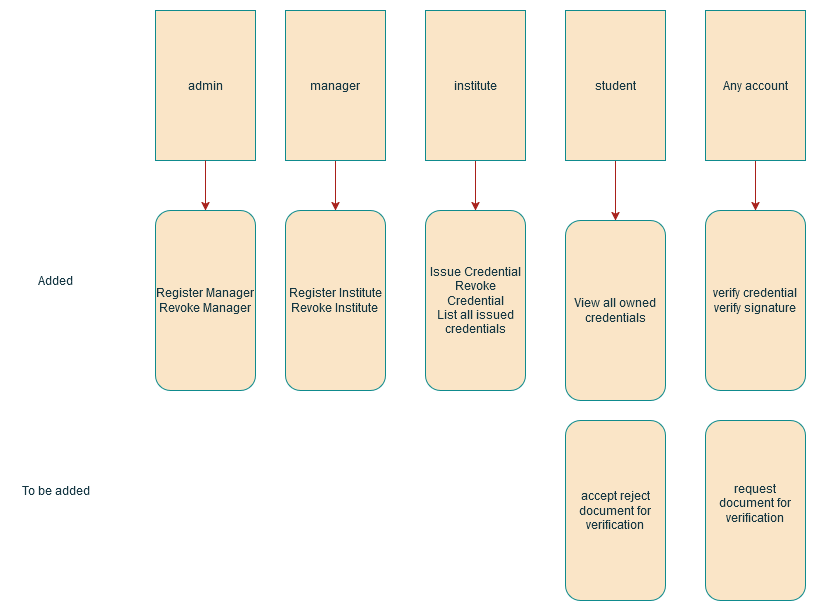

# NFT based Credentials Management System

This project is a blockchain-based credential management system that uses ERC721 NFTs to represent academic certificates. The smart contract is implemented with Hardhat and OpenZeppelin libraries, and the frontend is built with Thirdweb for seamless interaction with the blockchain.

---

## Features

1. **Mint Academic Credentials:** Institutions can mint NFTs representing academic credentials.
2. **Role-based Access Control:** Granular permissions using OpenZeppelin's `AccessControl`.
3. **Pause/Resume Contract:** Ability to pause contract operations during emergencies.
4. **Expiration Tracking:** Manage certificates with expiration dates.
5. **Frontend Integration:** User-friendly interface powered by Thirdweb.

---
### Illustration
---
####  Illustration of Complete Project

---
#### Off-chain server sequence diagram 
<!--  -->

[![Off-chain server sequence diagram](https://mermaid.ink/img/pako:eNrVV21v2zYQ_isEgQIZICeO7cSOPhQomiEzMKSpvaxAYSBgpYtNVCI1kkrqBfnvO4mSZb3ZUjpgWD-l1HPHu-deHvqFetIH6tJ374iGv2IQHlxztlYsXAk8S_6x2EgRh99A7Y4ipgz3eMSEIR8DDsI0frqRN1x8uJs3fryT2qwVLD__vhI7gHU2eP8-N3XJ3aflH-QMg9icCYnh7bA5ZIBwa-eSBehICp88c7MhZfjOdY5d8rWwGAv_At_G5JkFAZiO8TyB4o9bcpI6cYhGh8zECn5pjLFI2CV_Wkt7GzlRYBSHJyAMYw-Z8TaE-b4CrQtXhfmgFM8C8EpBEBwHpjs5aezcY4bLwnhnfisNEImYjAGnuO9e42mSPh4n9uB3qZ9KmksbfeYpQBtyok3sI_TBUuBgCNgXfP8EfkRcbR9CLmIDuoHTMqVzgYEZkl1kk7y_n1_njojhIX5gYdSBUuvDxup3JzW_fH6dVhJvM7HuRuvS8kFYFClEaCIVwQOOfyHVuedeVGeukvZKTx647xCjmNCe4pF5CLg2R2m9j_ykXnlmNiViJFnRzL-_okcZzbzo2POwqR_joDunmQ3B4mm2hl4MIIHb_fR_Jtu0GP9ZrkXn5E6c_bh_w3YLIF3VuD64l_X8sXQ_x4CDkWLBz7PWJMLdIH0c7iDYdt0_VScdma7dnXKt4El-fyvZNR2rilibgrXLV_XLAnyu68dlSWtp0ZtfsUOfzq2CrEGAwgQGmVZVCEvvSXaDVLAvVZluZBphzVJsmZzb1EIn1n7F9xHNrETfSTJb8l3sL-REIrHa1gUXZAPMz0tSz3uRy6LFP-JK3L-sIeOsGZvZLGCZ_Pp8zQ0LCuHOeiUwaabpEXliAc_Ya47yo1U0u_CTQmmsCapqYdMQ6NJiSsXptiIyw_m1NYJAw160XLTF2-YQlJJZBUD4eel7PwBy4j6kg8jFOm3yquxjBUvHykZShJu4uJWW9DqRbx2p9uJlowXPx8brQC3rY9aZ_N3FLTmWB68cZW34DjBUGkL0E2wPjmI7X8VI7oKpjuUBpvLxbM760KgmJi3j2mMyEy-NTdVU1QJbqy3st2y5eQ_2_9E62ffLMcMWSb0DhbUIcy3F4sooGYVatm1i-imH734Q9GrmqlG6mlr4qA1-Z0IaLf8vjORxV6iRuEwVUTL5oVOgj4ppRQqahyAboD6i1C55vcntT2wvUhsVq98L-Wefx296G_8LD-Ner2Lq0BBUyLhPXfqSGK8o9lwIK-omv22Y-p74fEVcwtByKzzqGhWDQ7Er1xvqPjJsWYfGqefsaZ1D8PH7VcpwB8L_U_eF_qDu4Hx6MTsdTaZXo8lsOLmcTS8cuqXuaDw7nYxG4-nsYjIcjq-Gl68O_Tv1MTodX14Or6YX51cjtB6Px6__AB8ZB9U?type=png)](https://mermaid.live/edit#pako:eNrVV21v2zYQ_isEgQIZICeO7cSOPhQomiEzMKSpvaxAYSBgpYtNVCI1kkrqBfnvO4mSZb3ZUjpgWD-l1HPHu-deHvqFetIH6tJ374iGv2IQHlxztlYsXAk8S_6x2EgRh99A7Y4ipgz3eMSEIR8DDsI0frqRN1x8uJs3fryT2qwVLD__vhI7gHU2eP8-N3XJ3aflH-QMg9icCYnh7bA5ZIBwa-eSBehICp88c7MhZfjOdY5d8rWwGAv_At_G5JkFAZiO8TyB4o9bcpI6cYhGh8zECn5pjLFI2CV_Wkt7GzlRYBSHJyAMYw-Z8TaE-b4CrQtXhfmgFM8C8EpBEBwHpjs5aezcY4bLwnhnfisNEImYjAGnuO9e42mSPh4n9uB3qZ9KmksbfeYpQBtyok3sI_TBUuBgCNgXfP8EfkRcbR9CLmIDuoHTMqVzgYEZkl1kk7y_n1_njojhIX5gYdSBUuvDxup3JzW_fH6dVhJvM7HuRuvS8kFYFClEaCIVwQOOfyHVuedeVGeukvZKTx647xCjmNCe4pF5CLg2R2m9j_ykXnlmNiViJFnRzL-_okcZzbzo2POwqR_joDunmQ3B4mm2hl4MIIHb_fR_Jtu0GP9ZrkXn5E6c_bh_w3YLIF3VuD64l_X8sXQ_x4CDkWLBz7PWJMLdIH0c7iDYdt0_VScdma7dnXKt4El-fyvZNR2rilibgrXLV_XLAnyu68dlSWtp0ZtfsUOfzq2CrEGAwgQGmVZVCEvvSXaDVLAvVZluZBphzVJsmZzb1EIn1n7F9xHNrETfSTJb8l3sL-REIrHa1gUXZAPMz0tSz3uRy6LFP-JK3L-sIeOsGZvZLGCZ_Pp8zQ0LCuHOeiUwaabpEXliAc_Ya47yo1U0u_CTQmmsCapqYdMQ6NJiSsXptiIyw_m1NYJAw160XLTF2-YQlJJZBUD4eel7PwBy4j6kg8jFOm3yquxjBUvHykZShJu4uJWW9DqRbx2p9uJlowXPx8brQC3rY9aZ_N3FLTmWB68cZW34DjBUGkL0E2wPjmI7X8VI7oKpjuUBpvLxbM760KgmJi3j2mMyEy-NTdVU1QJbqy3st2y5eQ_2_9E62ffLMcMWSb0DhbUIcy3F4sooGYVatm1i-imH734Q9GrmqlG6mlr4qA1-Z0IaLf8vjORxV6iRuEwVUTL5oVOgj4ppRQqahyAboD6i1C55vcntT2wvUhsVq98L-Wefx296G_8LD-Ner2Lq0BBUyLhPXfqSGK8o9lwIK-omv22Y-p74fEVcwtByKzzqGhWDQ7Er1xvqPjJsWYfGqefsaZ1D8PH7VcpwB8L_U_eF_qDu4Hx6MTsdTaZXo8lsOLmcTS8cuqXuaDw7nYxG4-nsYjIcjq-Gl68O_Tv1MTodX14Or6YX51cjtB6Px6__AB8ZB9U)
---

## Prerequisites

### Tools Required:
- **Node.js**: [Download here](https://nodejs.org/).
- **Golang**: For backend off-chain server
- **Hardhat**: For smart contract development.
- **Thirdweb SDK**: For frontend blockchain interactions.

Install dependencies:
```bash
npm install
```

---

## Smart Contract Setup

1. Clone the repository:
   ```bash
   git clone https://github.com/Saurav-Navdhare/NFT-CredentialManagementSystem
   cd NFT-CredentialManagementSystem
   ```

2. Install Hardhat:
   ```bash
   npm install --save-dev hardhat
   ```

3. Compile the smart contract:
   ```bash
   npx hardhat compile
   ```

4. Deploy the contract:
   ```bash
   npx hardhat run scripts/deploy.js --network <network-name>
   ```

5. Verify the deployment:
   ```bash
   npx hardhat verify <contract-address> --network <network-name>
   ```

---

## Frontend Setup

1. Install the all dependencies:
   ```bash
   npm install 
   ```

2. Start the development server:
   ```bash
   npm run start
   ```

3. Update the contract address in the frontend env file:
   ```env
   CONTRACT_DEPLOYED_ADDRESS= "<deployed-contract-address>";
   ```

---

## Usage

### Minting Credentials:
1. Connect as an authorized institution.
2. Provide student details, expiration dates, and IPFS hash of credentials.
3. Submit the transaction to mint a credential NFT.

### Viewing Credentials:
1. Connect as a student or verifier.
2. View issued credentials along with their status (VALID, REVOKED).

---

## Deployment Notes

- **Networks:** Configure networks in `hardhat.config.js`.
- **Environment Variables:**
  Create a `.env` file with:
```env
VITE_PUBLIC_THIRDWEB_CLIENT_ID=
VITE_PINATA_API_KEY=
VITE_PINATA_API_KEY=
VITE_PINATA_JWT=
GANACHE_PRIVATE_KEY=
CARADONA_PRIVATE_KEY=
CONTRACT_DEPLOYED_ADDRESS=
```

---

## Troubleshooting

### Common Issues:
1. **AccessControlUnauthorizedAccount:**
   Ensure the correct role is assigned for the attempted action.

---

## Future Enhancements

- Add email notifications for certificate expiration.
- Enable on-chain revocation alerts.

---

## License
This project is licensed under the MIT License. See `LICENSE` for details.

---

## Acknowledgments
- OpenZeppelin for secure smart contract libraries.
- Thirdweb for easy blockchain integration.
- Hardhat for powerful development tools.
